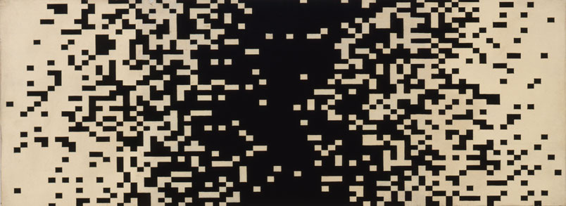
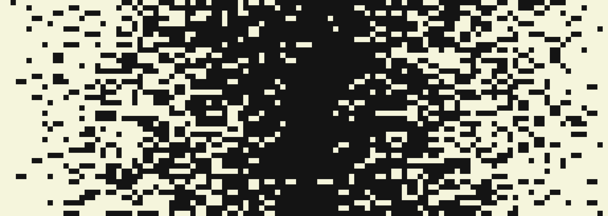
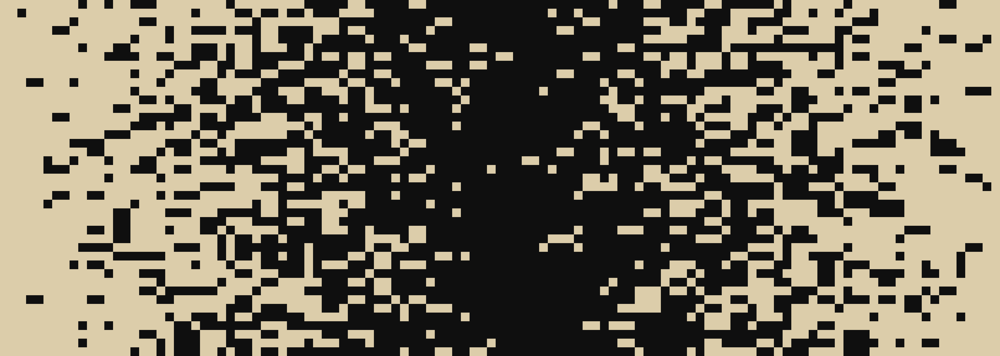
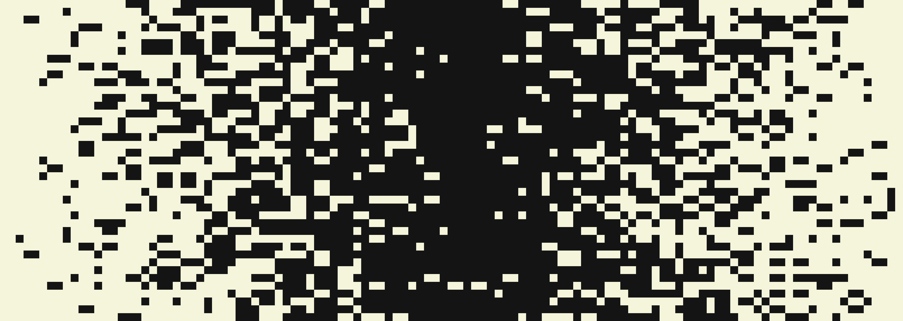

# Seine

Seine creates alternative renderings of Ellsworth Kelly's 1951 painting, *Seine*. The project is built in Python, and uses the Image module from the Python Imaging Library (PIL.)

## Background

In 1951, Ellsworth Kelly painted *Seine*, in which:
* "Each of the first 41 columns contains one more black rectangle than the one to its left."
* "Each of the next 40 following columns contains one more white rectangle than the one to its left."

(Quotes from [here](http://www.sas.upenn.edu/~chb/kelly/chen_bryan_artofresearch.pdf).)

In creating this piece, Kelly both represented the Seine, a Parisian river, and stumbled upon many of the notions that are at the core of [percolation theory](https://en.wikipedia.org/wiki/Percolation_theory).

Today, *Seine* is held at the [Philadelphia Museum of Art](http://www.philamuseum.org/collections/permanent/295031.html).

## What Seine Does

This Python script, when it is run, asks the user for:
* The number of images to create (the default is 1.)
* The width of the output image in pixels (the default is 3000 pixels.)

Then, Seine creates the requested number of *Seine* lookalikes, and saves them as PNG files in the directory it was run from.
Seine's output maintains Kelly's painting's aspect ratio. Addditionally, y editing some of the code, you can change the color of the background or the rectangles.

Here are three example renderings:

#### 1

#### 2

#### 3

